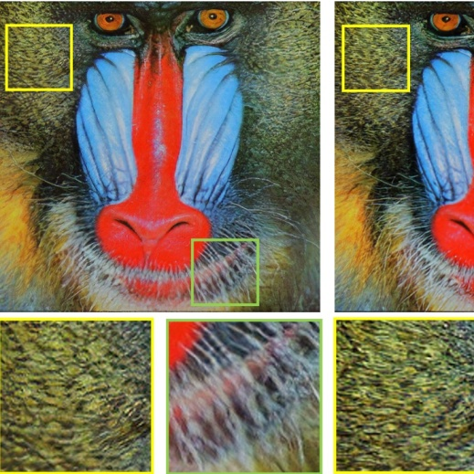
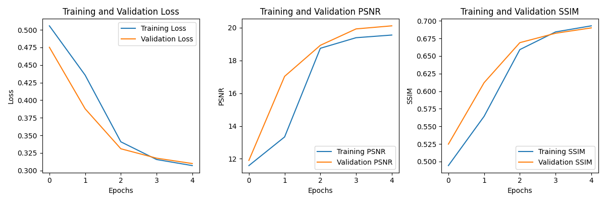
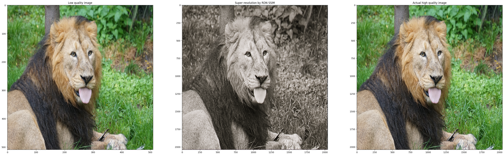
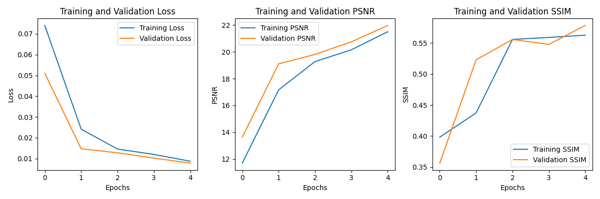
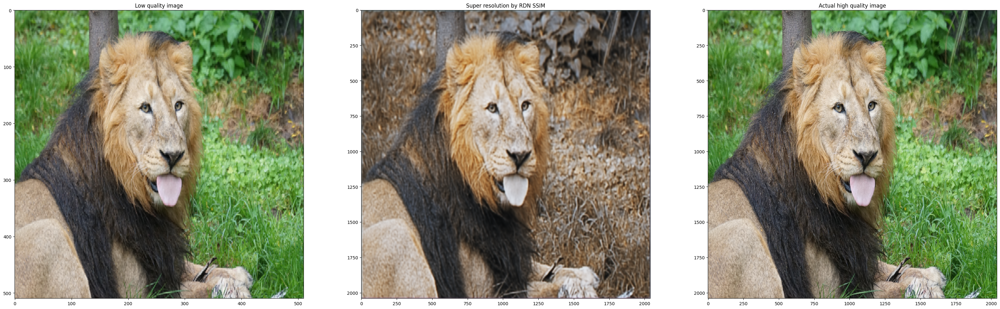

# Super Resolution Image Enhancement

## 🎯 Project Objective

This project implements and compares various deep learning models for image super-resolution, focusing on enhancing low-resolution images to create high-quality, detailed outputs. I work with the DIV2K dataset and implement multiple state-of-the-art architectures including RDN and Real-ESRGAN.

## 📝 Project Description

### What is Image Super-Resolution?

Image super-resolution is the process of enhancing the resolution of a low-resolution image to create a higher-resolution version with more details and clarity. This technology has numerous applications:

- Medical imaging enhancement
- Surveillance footage improvement
- Digital content restoration
- Mobile device display optimization
- Photography and digital art enhancement

### Models Implemented

1. **RDN (Residual Dense Network)**
   - Features dense connections within residual blocks
   - Global feature fusion
   - Trained with both MSE and SSIM loss functions
   
2. **Real-ESRGAN**
   - Enhanced version of ESRGAN for real-world applications
   - High-order degradation modeling
   - U-Net discriminator with spectral normalization
   - Trained on pure synthetic data

## 🔬 Methods Used
- Single-image super-resolution
- Deep convolutional neural networks
- Residual learning
- Generative adversarial networks

## 🛠️ Technologies
- Python
- TensorFlow/Keras
- OpenCV
- BasicSR
- GFPGAN
- NumPy
- Matplotlib

## 📥 Dataset

This project uses the DIV2K dataset, which contains 1000 2K resolution images:
- 800 training images
- 100 validation images

Each set includes:
- High-resolution original images
- Low-resolution versions (with x4 downscaling)
- Two downscaling tracks: bicubic and unknown degradation

[Download DIV2K Dataset](https://data.vision.ee.ethz.ch/cvl/DIV2K/)

### Citations
...
@InProceedings{Ignatov_2018_ECCV_Workshops,
author = {Ignatov, Andrey and Timofte, Radu and others},
title = {PIRM challenge on perceptual image enhancement on smartphones: report},
booktitle = {European Conference on Computer Vision (ECCV) Workshops},
month = {January},
year = {2019}
}

@InProceedings{wang2021realesrgan,
    author    = {Xintao Wang and Liangbin Xie and Chao Dong and Ying Shan},
    title     = {Real-ESRGAN: Training Real-World Blind Super-Resolution with Pure Synthetic Data},
    booktitle = {International Conference on Computer Vision Workshops (ICCVW)},
    date      = {2021}
}

Residual Dense Network for Image Super-Resolution by Yulun Zhang, Yapeng Tian, Yu Kong, Bineng Zhong, Yun Fu. Link: https://arxiv.org/pdf/1802.08797v2

## 🏆 Results

### RDN Model Performance

#### RDN with MSE Loss
- Final Training Loss: 0.009
- Final Validation Loss: 0.008
- Final Training PSNR: 21.50
- Final Validation PSNR: 21.97
- Final Training SSIM: 0.563
- Final Validation SSIM: 0.578

#### RDN with SSIM Loss
- Final Training Loss: 0.307
- Final Validation Loss: 0.310
- Final Training PSNR: 19.55
- Final Validation PSNR: 20.11
- Final Training SSIM: 0.693
- Final Validation SSIM: 0.690

### Analysis
1. MSE Loss model achieves better PSNR values
2. SSIM Loss model produces higher perceptual quality
3. Both models show stable training with consistent improvement

## 📊 Visualizations

### RDN SSIM model metrics and example

### RDN MSE model metrics and example

We can see in this particular image MSE performed better.

## 🚀 Future Work & Next Steps

### Model Training Pipeline

The following models are scheduled for training and evaluation:

1. **RRDN (Residual in Residual Dense Network)**
   - Enhanced version of RDN with additional residual connections
   - Expected to provide better feature preservation
   - Planned hyperparameters optimization

2. **EDSR (Enhanced Deep Super Resolution)**
   - Known for memory-efficient architecture
   - Removes unnecessary modules from conventional residual networks
   - Will test both shallow and deep variants

3. **SRGAN (Super Resolution GAN)**
   - Pioneering perceptual loss approach
   - Will implement with VGG-based feature loss
   - Focus on generating photorealistic textures

4. **RealESRGAN**
   - Enhanced version for real-world applications
   - Will train with high-order degradation model
   - Plan to implement face enhancement module

5. **CycleGAN**
   - Unpaired training approach
   - Will test effectiveness for domain adaptation
   - Focus on preserving content while enhancing resolution

6. **DRCT (Dense Residual Channel Transformer)**
   - Transformer-based architecture
   - Will explore attention mechanisms
   - Plan to optimize for computational efficiency

### Additional Planned Improvements
- [ ] Explore attention mechanisms
- [ ] Optimize model architecture for faster inference
- [ ] Test on different datasets

### Long-term Goals
- Create a streamlit app for image resolution
